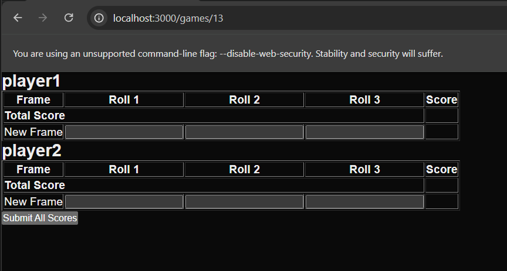

## 🔧 Prerequisites  

Before running the project, ensure you have the following installed:  

### General Requirements  
- [Docker & Docker Compose](https://docs.docker.com/get-docker/) (if using containers)  

### Backend (Golang)  
- [Golang](https://go.dev/dl/) (v1.20+ recommended)  
- [SQLite](https://www.sqlite.org/download.html) (if using SQLite locally)  

### Frontend (React/Next.js)  
- [Node.js & npm](https://nodejs.org/en/download) (v22.14+ recommended)  

Now you can proceed to **Setup & Run**. 🚀

## Run locally
### Without docker
- backend
    ```
    make install-backend && make run-backend
    ```
- frontend
    ```
    make frontend-build && make frontend-start
    ```

### With docker
```
docker-compose up
```
### API Endpoints

#### Create a New Game
**Endpoint:** `POST /games`  
**Description:** Creates a new bowling game with the given player names.  

**Request:**
```sh
curl -X POST http://localhost:8080/games \
  -H "Content-Type: application/json" \
  -d '{
    "player_names": ["Alice", "Bob", "Charlie"]
  }'
```

#### Submit Frame Scores  
**Endpoint:** `POST /games/{game_id}/frames`  
**Description:** Submits frame scores for players in a given game.  

**Request:**
```sh
curl -X POST http://localhost:8080/games/1/frames \
  -H "Content-Type: application/json" \
  -d '{
    "scores": {
      "1": {
        "frame_number": 1,
        "roll1": "X",
        "roll2": null,
        "roll3": null
      },
      "2": {
        "frame_number": 1,
        "roll1": "5",
        "roll2": "/",
        "roll3": null
      },
      "3": {
        "frame_number": 1,
        "roll1": "5",
        "roll2": "/",
        "roll3": null
      }
    }
  }'
```

**Endpoint:** `GET /games/{game_id}`  
**Description:** Retrieves game details, including players and their frames.  

**Request:**
```sh
curl http://localhost:8080/games/1
```

## How to use the UI
Access `http://localhost:3000/register` to get to the register page for players

Clicking `Start game` will redirect you to a scoreboard page

Enter scores for all players as you play

If 10 frames have passed, the winner's name will be displayed
